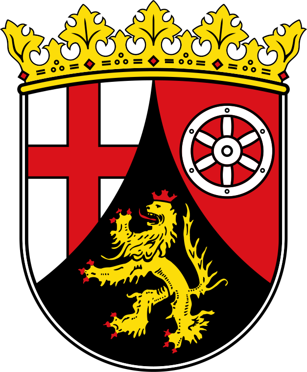

# Rhineland-Palatinate

[name::Rheinland-Pfalz] 

[name-abbr::RZ] 

#has_/url_for_/code_repository :: https://github.com/SpocWiki/Germany-Rheinland-Pfalz 

This Repository/Folder/Wiki/Vault contains freely usable Text and Data 
covering the German state of [Rhineland-Palatinate](https://en.wikipedia.org/wiki/Rhineland-Palatinate).   

This Repository is intended to be shared as a common basis, 
by including it as a Sub-Repository in local File-Systems, 
specifically as part of the [\_Standards](https://github.com/SpocWiki/_Standards) Repository. 

Check out this Repository into this Subfolder: 
\_Standards\geo\Continent\Europe\Europe~Central\Germany\Germany~West\Rheinland-Pfalz 


## #has_/text_of_/abstract  

## Maps and Flags 

## #has_/image_for_/coat_of_arms 


#has_/image_for_/coat_of_arms :: ![[./Coat_of_arms_of_Rhineland-Palatinate.svg|250]] 

## #has_/image_for_/flag


#has_/image_for_/flag :: ![[./Flag_of_Rhineland-Palatinate.svg|200]]  

## #has_/map 

```leaflet
id: Rheinland-Pfalz
zoomFeatures: true 
minZoom: 2 
maxZoom: 18
geojsonFolder: ./
markerFolder: ./
```

has_place_country:: [[Germany]]  
Capital :: [[Mainz]]  
#is_a_/Place  
#is_a_ :: [[Place]] 
[has_place_longitude::7.57652] 
[has_place_latitude::49.914] 
[Population::] 


## Confidential Links & Embeds: 
- [[Rheinland-Pfalz|Rheinland-Pfalz]]  
- [[../../../../../../_internal/geo/Continent/Europe/Germany/West/Rheinland-Pfalz.internal|Rheinland-Pfalz.internal]] 
- [[../../../../../../_protect/geo/Continent/Europe/Germany/West/Rheinland-Pfalz.protect|Rheinland-Pfalz.protect]] 
- [[../../../../../../_private/geo/Continent/Europe/Germany/West/Rheinland-Pfalz.private|Rheinland-Pfalz.private]] 
- [[../../../../../../_personal/geo/Continent/Europe/Germany/West/Rheinland-Pfalz.personal|Rheinland-Pfalz.personal]] 
- [[../../../../../../_secret/geo/Continent/Europe/Germany/West/Rheinland-Pfalz.secret|Rheinland-Pfalz.secret]] 
