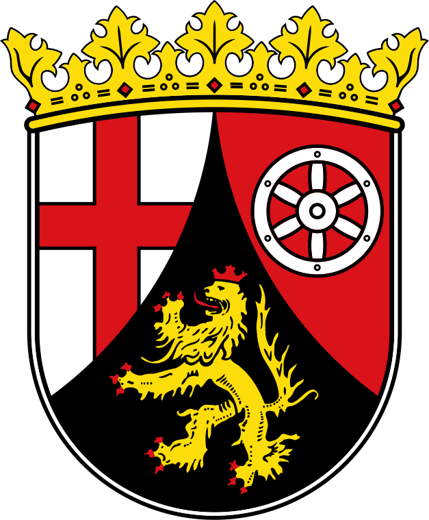
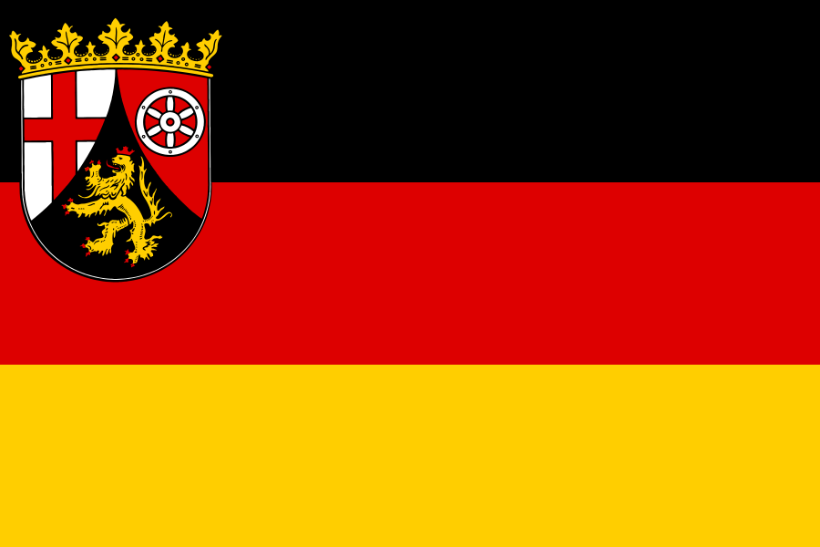

# Rhineland-Palatinate

[name::Rheinland-Pfalz] 

[name-abbr::RZ] 

#has_/url_for_/code_repository :: https://github.com/SpocWiki/Germany-Rheinland-Pfalz 

This Repository/Folder/Wiki/Vault contains freely usable Text and Data 
covering the German state of [Rhineland-Palatinate](https://en.wikipedia.org/wiki/Rhineland-Palatinate).   

This Repository is intended to be shared as a common basis, 
by including it as a Sub-Repository in local File-Systems, 
specifically as part of the [\_Standards](https://github.com/SpocWiki/_Standards) Repository. 

Check out this Repository into this Subfolder: 
\_Standards/Earth/Continent/Europe/Europe~Central/Germany/Germany~West/Rheinland-Pfalz 


## #has_/text_of_/abstract  


> **Rhineland-Palatinate** is a western state of Germany. 
> It covers 19,846 km² and has about 4.05 million residents. 
> It is the ninth largest and sixth most populous of the sixteen states. 
> Mainz is the capital and largest city. Other cities are Ludwigshafen am Rhein, 
> Koblenz, Trier, Kaiserslautern, Worms and Neuwied. 
> It is bordered by North Rhine-Westphalia, Saarland, Baden-Württemberg and Hesse 
> and by France, Luxembourg and Belgium.
>
> Rhineland-Palatinate was established in 1946 after World War II, from parts of the 
> former states of Prussia (part of its Rhineland and Nassau provinces), 
> Hesse (Rhenish Hesse) and Bavaria (its former outlying Palatinate kreis or district), 
> by the French military administration in Allied-occupied Germany. 
> 
> Rhineland-Palatinate became part of the Federal Republic of Germany in 1949 
> and shared the country's only border with the Saar Protectorate 
> until the latter was returned to German control in 1957. 
> 
> Rhineland-Palatinate's natural and cultural heritage includes 
> the extensive Palatinate winegrowing region, picturesque landscapes, 
> and many castles and palaces. 
> 
> Rhineland-Palatinate is currently the only federal state in Germany 
> where nuclear weapons are stored extraterritorially 
> under the responsibility and supervision of US forces.
>
> [Wikipedia](https://en.wikipedia.org/wiki/Rhineland-Palatinate) 


## Maps and Flags 

### #has_/image_for_/coat_of_arms 


#has_/image_for_/coat_of_arms :: ![[./Coat_of_arms_of_Rhineland-Palatinate.svg|250]] 

### #has_/image_for_/flag

#has_/image_for_/flag :: ![[./Flag_of_Rhineland-Palatinate.svg|200]]  


### #has_/map :: [DEU-Germany-1580-Rheinland-Pfalz.geojson](./DEU-Germany-1580-Rheinland-Pfalz.geojson) 

```leaflet
id: Rheinland-Pfalz
zoomFeatures: true 
minZoom: 2 
maxZoom: 18
geojsonFolder: ./
markerFolder: ./
```

has_place_country:: [[Germany]]  
Capital :: [[Mainz]]  


#is_a :: [[City]]
[has_place_longitude::7.57652] 
[has_place_latitude::49.914] 
[Population::] 


## Confidential Links & Embeds: 

### #is_/same_as :: [[/_Standards/Earth/Continent/Europe/Europe~Central/Germany/Germany~West/Rheinland-Pfalz/ReadMe|ReadMe]] 

### #is_/same_as :: [[/_public/Earth/Continent/Europe/Europe~Central/Germany/Germany~West/Rheinland-Pfalz/ReadMe.public|ReadMe.public]] 

### #is_/same_as :: [[/_internal/Earth/Continent/Europe/Europe~Central/Germany/Germany~West/Rheinland-Pfalz/ReadMe.internal|ReadMe.internal]] 

### #is_/same_as :: [[/_protect/Earth/Continent/Europe/Europe~Central/Germany/Germany~West/Rheinland-Pfalz/ReadMe.protect|ReadMe.protect]] 

### #is_/same_as :: [[/_private/Earth/Continent/Europe/Europe~Central/Germany/Germany~West/Rheinland-Pfalz/ReadMe.private|ReadMe.private]] 

### #is_/same_as :: [[/_personal/Earth/Continent/Europe/Europe~Central/Germany/Germany~West/Rheinland-Pfalz/ReadMe.personal|ReadMe.personal]] 

### #is_/same_as :: [[/_secret/Earth/Continent/Europe/Europe~Central/Germany/Germany~West/Rheinland-Pfalz/ReadMe.secret|ReadMe.secret]] 

